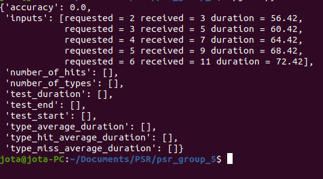

# PSR-2022-23

# PSR Typing Test - tp1 - P1 - grupo 5

## Funcionamento

 O programa  desenvolvido consiste num jogo do tipo typing test onde é pedido ao utilizador que escreva de modo sequencial e o mais rapido possível, as letras que são pedidas aleatoriamente pelo  computador.
O jogo pode terminar de 3 maneiras distintas: 
- Caso o utilizador defina um tempo inicial de jogo, este termina decorrido esse tempo. 
- Pode também definir o número de letras que lhe serão apresentadas e o jogo terminará quando todas tiverem sido inseridas.
- Caso a tecla 'spacebar' seja premida, o jogo terminará instantaneamente.
Após o termino do jogo serão apresentadas diferentes paramêtros que resumem o desempenho do utilizador, como se pode ver na imagem seguinte:

## Execução do jogo
Para executar o typing test, no diretório da pasta com os ficheiros .py executar no terminal o seguinte comando:
`$ python3 run.py -mv 5`   

ou

`$ python3 run.py -utm -mv 10`

## Descrição do código

Inicialmente são definidos os parametros iniciais com o uso do módulo argparse que obriga ao utilizador a definir -mv number, com number = número de inputs necessários. Se não for  especificado number o programa define 10 como o número de inputs antes do fim do jogo. 

O comando opcional -utm seconds, com seconds = segundos até ao fim do jogo, ativará o modo em que o jogo funciona em função do tempo e não dos inputs.

Foram geradas listas que armazenam as letras pedidas ao utilizador pelo computador e as letras que o utilizador respondeu, bem como o tempo entre cada input. 

 A hora de inicio e fim do jogo, obtidas usando o módulo time, permitiram saber a duração do teste bem como o tempo médio necessário ao utilizar para acertar ou errar uma letra. 

 Estas listas e valores foram depois usadas para calcular estatisticas como a taxa de acerto (accuracy) e o número de letras erradas e certas.

Por fim estes valores foram armazenados num dicionário que é mostrado com recurso ao package prettyprint que permite ao utilizador a visualização de todos os parametros {accuracy, inputs, number_of_hits, number_of_types, test_duration, test_end, test_start, type_average_duration, type_hit_average_duration, type_miss_average_duration}.

Foi feita uma  personalização das cores disponibilizadas no terminal durante o jogo, para uma melhor compreensão, com recurso ao módulo colorama que pode ser instalado usando:
`$ pip install colorama`.

O ficheiro records.txt  definido pela função write armazena um histórico e mostra o número de letras corretas e o tempo total de cada jogo.

